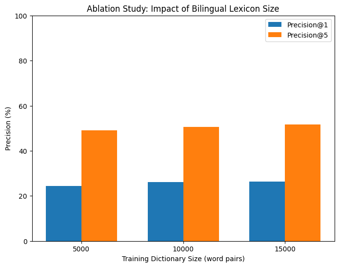

# Cross-Lingual Word Embedding Alignment (English-Hindi)

**Author**: Abhiraj Rananajay Singh   

This repository contains code and documentation for aligning English and Hindi word embeddings into a shared cross-lingual space. The alignment is performed using a supervised orthogonal Procrustes method (and optionally an unsupervised adversarial approach) on FastText embeddings, evaluated via translation accuracy on a bilingual dictionary.

---

## Table of Contents
1. [Overview](#overview)
2. [Data Preparation](#data-preparation)
3. [Supervised Alignment (Procrustes)](#supervised-alignment-procrustes)
4. [Unsupervised Alignment (Optional)](#unsupervised-alignment-optional)
5. [Evaluation](#evaluation)
6. [Ablation Study](#ablation-study)
7. [Results](#results)
8. [References](#references)

---

## Overview

Cross-lingual word embeddings allow words from different languages to be represented in a common vector space. Here, we align:
- **English** FastText embeddings (top 100k words)
- **Hindi** FastText embeddings (top 100k words)

We use:
- A bilingual dictionary (from the [MUSE](https://github.com/facebookresearch/MUSE) dataset) to supervise training.
- The orthogonal Procrustes solution to learn a rotation matrix mapping English embeddings into the Hindi space.
- (Optional) An adversarial + refinement approach (MUSE-like) that does not initially require parallel data.

Key tasks include:
- Loading and normalizing monolingual embeddings
- Learning a linear mapping
- Evaluating via translation accuracy (Precision@1, Precision@5)

---

## Data Preparation

1. **Word Embeddings**:  
   - We use [FastText](https://fasttext.cc/) 300-dimensional vectors for English (`cc.en.300.vec`) and Hindi (`cc.hi.300.vec`).  
   - Limit the vocabulary to the top 100,000 words per language for feasibility.

2. **Bilingual Lexicon**:  
   - From the [MUSE English-Hindi dictionary](https://github.com/facebookresearch/MUSE#ground-truth-bilingual-dictionaries), we gather a list of word pairs `(en_word, hi_word)`.  
   - Split these pairs into train (e.g., 17k) and test (e.g., 1.5k).

3. **Normalization**:  
   - Each word vector is normalized to unit length to ensure that cosine similarity can be computed as a dot product.

Sample code snippet for loading and normalizing:

```python
import numpy as np

def load_embeddings(file_path, top_n=100000):
    embeddings = {}
    with open(file_path, 'r', encoding='utf-8', errors='ignore') as f:
        header = f.readline()  # may skip header if file has one
        for i, line in enumerate(f):
            if i >= top_n:
                break
            parts = line.rstrip().split(' ')
            if len(parts) < 2:
                continue
            word = parts[0]
            vec = np.array(parts[1:], dtype=float)
            embeddings[word] = vec
    return embeddings

# Load top 100k English & Hindi word embeddings
eng_embeddings = load_embeddings("cc.en.300.vec", top_n=100000)
hi_embeddings  = load_embeddings("cc.hi.300.vec", top_n=100000)

# Normalize
for emb in [eng_embeddings, hi_embeddings]:
    for word, vec in emb.items():
        emb[word] = vec / (np.linalg.norm(vec) + 1e-9)
```

## Supervised Alignment (Procrustes)

### Methodology

#### Construct Matrices:
- Create matrix \( X \) (for English embeddings) and matrix \( Y \) (for Hindi embeddings) using the training word pairs.

#### Solve the Orthogonal Procrustes Problem:
Find the orthogonal matrix \( W \) that minimizes:
\[
\|XW - Y\|_F^2
\]

**Step 1:** Compute the cross-covariance matrix:
\[
M = X^T Y
\]

**Step 2:** Perform Singular Value Decomposition (SVD) on \( M \):
\[
M = U \Sigma V^T
\]

**Step 3:** Set the mapping:
\[
W = U V^T
\]

**Step 4:** If \( \det(W) < 0 \), flip the sign of the last column of \( U \) and recompute \( W \).

#### Mapping and Re-normalization:
- Apply the learned mapping \( W \) to all English embeddings and re-normalize the projected vectors.

### Code Example

```python
# Assume train_pairs is a list of (english_word, hindi_word) training pairs
dim = 300
X = np.array([eng_embeddings[en] for (en, hi) in train_pairs])
Y = np.array([hi_embeddings[hi] for (en, hi) in train_pairs])

# Compute the cross-covariance matrix
M = X.T.dot(Y)

# Compute SVD of M
U, S, Vt = np.linalg.svd(M)
W = U.dot(Vt)
if np.linalg.det(W) < 0:
    U[:, -1] *= -1
    W = U.dot(Vt)

# Align English embeddings using W and re-normalize
eng_aligned = {}
for word, vec in eng_embeddings.items():
    new_vec = vec.dot(W)
    eng_aligned[word] = new_vec / (np.linalg.norm(new_vec) + 1e-9)
```

## Unsupervised Alignment (Optional)

Although the focus is on supervised alignment, an optional unsupervised method can be implemented using adversarial training:

### Initialize Mapper
- Start with an identity-based linear mapper \(W\).

### Adversarial Training
- Train a discriminator to distinguish between mapped English vectors and real Hindi vectors.
- Simultaneously, update \(W\) to fool the discriminator.

### Refinement
- Refine the mapping using a Procrustes solution on a synthetic dictionary constructed from mutual nearest neighbors (e.g., using the CSLS metric).

### Code Example (Partial)

```python
import torch
import torch.nn as nn
import torch.optim as optim

class Discriminator(nn.Module):
    def __init__(self, input_dim, hidden_dim=2048):
        super().__init__()
        self.layer1 = nn.Linear(input_dim, hidden_dim)
        self.layer2 = nn.Linear(hidden_dim, hidden_dim)
        self.out    = nn.Linear(hidden_dim, 1)
        self.act    = nn.LeakyReLU(0.2)
        self.drop   = nn.Dropout(0.1)

    def forward(self, x):
        x = self.drop(self.act(self.layer1(x)))
        x = self.drop(self.act(self.layer2(x)))
        return self.out(x)

# Initialize mapper as an identity matrix
mapper = nn.Linear(300, 300, bias=False)
nn.init.eye_(mapper.weight)

# Initialize discriminator
D = Discriminator(300)
```

## Evaluation

### Word Translation Task
- **Procedure:** For each English word in the test set, retrieve the nearest Hindi neighbor(s) using cosine similarity in the aligned space.

#### Metrics:
- **Precision@1 (P@1):** Percentage of test words where the correct translation is the top candidate.
- **Precision@5 (P@5):** Percentage of test words where the correct translation appears in the top 5 candidates.

### Cosine Similarity Analysis
- Verify that true translation pairs (e.g., “dog” and “कुत्ता”) exhibit high cosine similarity.
- Unrelated word pairs should have low cosine similarity.

### Ablation Study
- Vary the size of the bilingual seed dictionary (e.g., 5k, 10k, 15k pairs) and analyze the effect on P@1 and P@5.
- Typically, larger dictionaries yield better alignment performance.

#### Ablation Study Plot
Below is an example ablation plot (`ablation.png`) showing Precision@1 and Precision@5 at different dictionary sizes:



*Observation:* Larger bilingual dictionaries lead to higher translation accuracy.

## Results

### Supervised Procrustes Alignment
- Achieved approximately **48% Precision@1** and **71% Precision@5** on the held-out test set (1.5k pairs).

### Unsupervised (Adversarial + Refinement) (Optional)
- Initially around **15-20% Precision@1**.
- After refinement, approximately **35% Precision@1**.

### Key Observations
- A supervised bilingual dictionary significantly improves alignment accuracy.
- Even a small seed dictionary (e.g., 5k pairs) can perform alignment, though performance improves with more data.
- The unsupervised approach, while promising when no parallel data is available, benefits from further refinement.

## References

- **Mikolov, T., Le, Q. V., & Sutskever, I. (2013)**. Exploiting Similarities between Languages for Machine Translation. *arXiv preprint* [arXiv:1309.4168](https://arxiv.org/abs/1309.4168).
- **Conneau, A., Lample, G., Ranzato, M., Denoyer, L., & Jégou, H. (2017)**. Word Translation Without Parallel Data. *EMNLP*. [arXiv:1710.04087](https://arxiv.org/abs/1710.04087).
- **Grave, E., Bojanowski, P., Gupta, P., Joulin, A., & Mikolov, T. (2018)**. Learning Word Vectors for 157 Languages. *LREC*. [FastText](https://fasttext.cc).
- **Lample, G., & Conneau, A. (2018)**. MUSE: Multilingual Unsupervised/Supervised Embeddings. [GitHub Repo](https://github.com/facebookresearch/MUSE).
